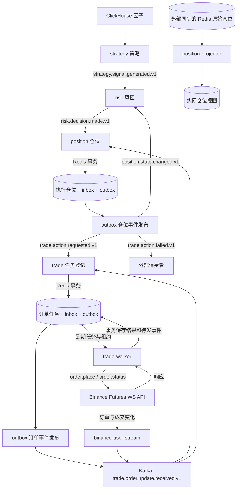
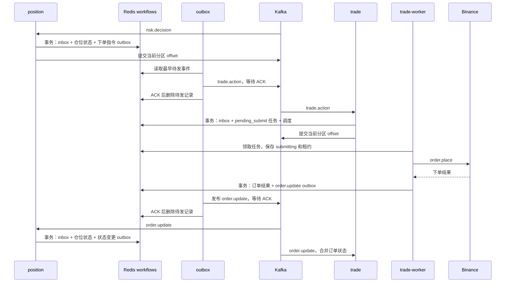
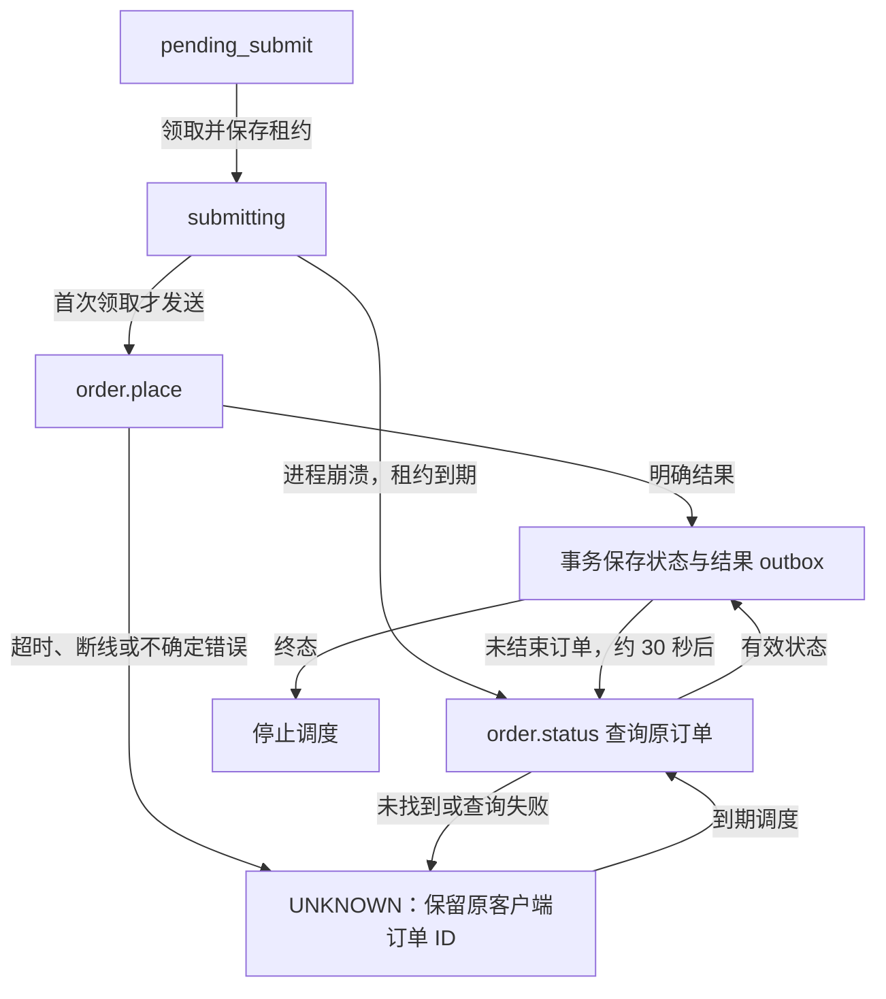

# Trading Engine Platform

基于 Python 3.11+ 的事件驱动交易平台，包含策略、风控、仓位状态机、持久化交易任务、Binance 用户流和 Redis 仓位投影。

**当前执行链路必须同时运行 `trade`、`trade-worker` 和 `outbox`。** `trade` 登记任务，`trade-worker` 下单与查单，`outbox` 发布已持久化的事件。

旧部署启动前需要迁移执行状态；已核对为空的新账户可以初始化空库。详见 [inbox/outbox 操作说明](docs/inbox-outbox-operations.md)。

## 系统架构



带 Topic 名称的连线通过 Kafka 传递消息。图中的两个 outbox 发布节点由同一个 `outbox` 进程处理。
执行仓位和实际仓位视图使用不同键空间；投影器不覆盖执行状态，也没有直接为风控加载初始仓位。

### 一次下单的完整流程



用户流也会直接发布订单更新，可能早于下单响应到达。仓位流程匹配活动订单身份，交易流程阻止已知终态被迟到的 NEW 覆盖；消费到的订单更新不会再回发 outbox 形成循环。

### UNKNOWN 与重启恢复



UNKNOWN 不自动重新下单。查询未找到不等于从未下单；在保存 submitting 后、发送前崩溃的任务也可能需要人工核对。
worker 对账覆盖系统已知订单，不等于全账户持仓、资金和历史成交对账。

### 可靠性边界

- 仓位和交易消费者用 Redis WATCH/MULTI/EXEC 一起保存输入回执、状态、待发事件及任务调度，成功后手动提交当前 Kafka 分区的 offset。
- relay 收到 Kafka ACK 才删除待发记录。发送成功但删除前崩溃会重发相同 event_id，下游用持久化 inbox 去重。
- 这是至少一次投递，不是 Redis、Kafka 与 Binance 之间的分布式事务或端到端 exactly-once。
- Redis 运行时命令错误不提供事务回滚；需保持工作流键的独占类型，并按业务要求配置持久化、备份与故障恢复。inbox 不自动过期，需规划容量。
- 风控仍使用原消费路径，本次可靠性改造没有覆盖所有引擎。

## 进程职责

| 命令名 | 职责 | 停止后的影响 |
| --- | --- | --- |
| `strategy` | 从 ClickHouse 读取因子并发布信号 | 不产生新策略信号 |
| `risk` | 根据本地仓位快照评估信号 | 不产生新风险决策 |
| `position` | 管理执行仓位，事务生成交易动作 | 不处理新的仓位决策和回报 |
| `trade` | 持久化订单任务、合并订单更新 | 新下单任务不会登记 |
| `trade-worker` | 领取任务下单，查询 UNKNOWN 和未结束订单 | 任务不会执行，也没有定期查单 |
| `outbox` | 发布仓位和交易的两个 Redis 待发事件流 | 下单指令和订单结果停留在 Redis |
| `binance-user-stream` | 接收 Binance 订单与成交更新并发布到 Kafka | 缺少实时回报，已知订单依靠 worker 补查 |
| `position-projector` | 将外部同步的原始仓位投影为实际仓位视图 | 实际仓位视图不再刷新 |
| `position-debug-dashboard` | 展示执行状态和转换历史 | 不影响核心执行流程 |
| `position-state-migrate` | 预览/迁移旧状态或初始化空库，一次性命令 | 未初始化的仓位引擎拒绝启动 |

新订单权威文档位于 `TRADE_WORKFLOW_KEY_PREFIX`。旧 `ORDER_REDIS_KEY_PREFIX` 仓库仅为兼容迁移来源，worker 启动时将其活动订单导入查询恢复路径；新结果不再双写旧索引。

## 仓库结构

```text
src/trading_engine/
  app/          # 入口、工作流、Kafka 处理器和组件装配
  common/       # 日志工具
  config/       # 环境变量配置
  contracts/    # 跨引擎事件契约与序列化
  domain/       # 公共领域模型
  infra/        # Redis 工作流存储、Kafka、ClickHouse 和 Binance 适配器
  position/     # 仓位状态机与仓储协议
  strategy/     # 策略规则与算法
  trade/        # 交易执行模型与网关协议
tests/unit/     # 包含 workflow 离线故障场景测试
docs/           # 操作说明、诊断报告与视图规范
```

## 安装

需要 Python 3.11+、Kafka、Redis；策略进程需要 ClickHouse，交易执行需要 Binance Futures API 凭据。

Linux/macOS：

```bash
python -m venv .venv
source .venv/bin/activate
python -m pip install -e '.[dev,runtime]'
```

Windows PowerShell：

```powershell
python -m venv .venv
.\.venv\Scripts\Activate.ps1
python -m pip install -e ".[dev,runtime]"
```

## 初始化与启动

统一命令格式：

```bash
python -m trading_engine --list-engines
python -m trading_engine <engine-name> -- <engine-specific-arguments>
```

直接运行 Python 命令前需要将 `.env` 加载到环境；`start.sh` 会自动加载它。

```bash
set -a
source .env
set +a
```

### 保留旧数据的升级

停止旧写入进程，先预览：

```bash
python -m trading_engine position-state-migrate
```

按 [迁移说明](docs/inbox-outbox-operations.md) 核对仓位和订单后再使用 `-- --apply`，保留原消费者组和 offset。
带投影标记的负数空仓有按币种确认选项 `--normalize-signed-short SYMBOL`，但不能绕过方向冲突或活动订单检查。

### 旧数据作废，从空状态开始

适用于已经核对 **Binance 实际无持仓、无未完成订单** 的账户。停掉旧进程，在 `.env` 中设置一套从未使用过的新前缀和消费者组：

```dotenv
POSITION_EXECUTION_KEY_PREFIX=position:execution:fresh1
TRADE_WORKFLOW_KEY_PREFIX=trade:execution:fresh1
ORDER_REDIS_KEY_PREFIX=order:fresh1
POSITION_ENGINE_CONSUMER_GROUP=position-engine-fresh1
TRADE_ENGINE_CONSUMER_GROUP=trade-engine-fresh1
RISK_ENGINE_CONSUMER_GROUP=risk-engine-fresh1
KAFKA_ACKS=all
```

重新加载 `.env`，使用不存在的旧前缀跳过旧记录：

```bash
python -m trading_engine position-state-migrate -- --legacy-prefix unused:legacy:fresh1 --apply --initialize-empty
```

成功时输出 `[]` 并写入初始化标记。此操作不平仓、不撤单、不删除旧数据；旧订单前缀一并更换，是为了避免 worker 恢复旧活动订单。重复重建时使用新的后缀，所有进程使用同一套配置。

### 推荐启动顺序

```bash
# 先启动消费者
bash start.sh position
bash start.sh trade
bash start.sh risk

# 检查日志与消费者组，确认 Kafka 分区分配完成后再执行
bash start.sh outbox
bash start.sh trade-worker
bash start.sh binance-user-stream

# 最后启用策略
bash start.sh strategy
```

这些命令本身不等待就绪。新消费者组使用 latest，生产者过早发布可能让消费者错过启动阶段的事件。
`start.sh all` 已包含 outbox、worker 和用户流，但没有就绪屏障，首次初始化采用上述分步启动方式。
脚本默认 Python 路径为 `.trading/bin/python`，可用 `ENGINE_PYTHON` 覆盖；日志写入 `nohup-<engine>.log`。

### 常用命令

```bash
# 策略：一次或持续执行
python -m trading_engine strategy -- --once --symbol BTCUSDT
python -m trading_engine strategy -- --stream --interval-seconds 1

# 分别在独立进程运行
python -m trading_engine trade-worker
python -m trading_engine outbox
python -m trading_engine binance-user-stream

# 按需启用视图和看板
python -m trading_engine position-projector -- --stream --interval-seconds 2
python -m trading_engine position-debug-dashboard

# 停止后台进程
bash stop.sh all
```

`outbox` 和 `trade-worker` 支持 `-- --once`；worker 的 once 会执行真实任务，不是 dry-run。
默认市价单，限价单需要动作 metadata 中的 `price` 和 `timeInForce`。当前执行通道为 Binance USD-M Futures。
生产仓位流程不再按本地超时回滚，恢复由订单回报和 worker 查询驱动。

看板默认地址为 `http://127.0.0.1:8001/`，可配置 `POSITION_DEBUG_HOST`、`POSITION_DEBUG_PORT`。
看板优先读取执行状态；历史由 outbox observer 尽力记录，可能遗漏或重复，不是权威审计账本。

## 事件契约

事件信封包含 `event_id`、`event_type`、`schema_version`、`occurred_at`、`producer`、`correlation_id`、`causation_id` 和 `payload`。
兼容字段扩展保留 Topic 版本；破坏兼容性的修改使用新 Topic 版本。

| Topic | 逻辑生产者与发布路径 | 消费者 |
| --- | --- | --- |
| `strategy.signal.generated.v1` | strategy 直接发布 | risk |
| `risk.decision.made.v1` | risk 直接发布 | position |
| `trade.action.requested.v1` | position → outbox | trade |
| `trade.action.failed.v1` | position → outbox | 外部消费者 |
| `trade.order.update.received.v1` | worker/交易校验 → outbox；用户流直接发布 | position、trade |
| `position.state.changed.v1` | position → outbox | risk、外部消费者 |

订单更新保留 `last_filled_quantity`（最近一笔成交）、`cumulative_filled_quantity`（累计成交）和兼容字段 `filled_quantity`。
当前仓位流程按累计成交差值更新数量；部分成交后撤单仍需完善。

## 配置

配置来自环境变量。使用 `start.sh` 时，脚本还会加载仓库根目录下的 `.env` 文件。

### 公共配置

| 环境变量 | 默认值 |
| --- | --- |
| `KAFKA_BOOTSTRAP_SERVERS` | `localhost:9092` |
| `KAFKA_ACKS` | Python default: `1`; outbox requires `all`/`-1`; start.sh default: `all` |
| `LOG_LEVEL` | `INFO` |
| `LOG_FILE` | `./trading_engine.log` |

### 策略与 ClickHouse

| 环境变量 | 默认值 |
| --- | --- |
| `STRATEGY_MIN_CONFIDENCE` | `0.55` |
| `STRATEGY_MAX_DATA_AGE_SECONDS` | `2` |
| `STRATEGY_SIGNAL_TOPIC` | `strategy.signal.generated.v1` |
| `CLICKHOUSE_HOST` | `127.0.0.1` |
| `CLICKHOUSE_PORT` | `8123` |
| `CLICKHOUSE_USER` | 适配器默认值 |
| `CLICKHOUSE_PASSWORD` | 适配器默认值 |
| `CLICKHOUSE_DATABASE` | `binance` |
| `CLICKHOUSE_TABLE` | `v_usdt_futures_trend_score_calc` |
| `CLICKHOUSE_QUERY` | 默认不设置，可覆盖查询语句 |

### 风控引擎配置

| 环境变量 | 默认值 |
| --- | --- |
| `RISK_ENGINE_CONSUMER_GROUP` | `risk-engine` |
| `RISK_SIGNAL_TOPIC` | `strategy.signal.generated.v1` |
| `RISK_POSITION_STATE_TOPIC` | `position.state.changed.v1` |
| `RISK_DECISION_TOPIC` | `risk.decision.made.v1` |
| `RISK_REQUIRE_POSITION_SNAPSHOT` | `false` |
| `RISK_DEFAULT_OPEN_QUANTITY` | `1.0` |
| `RISK_DEFAULT_OPEN_NOTIONAL` | `0`（关闭；大于 0 时按 notional/price 计算下单数量） |

仓位快照不是必需项时，缺失的快照会被视为空仓。生产环境建议设置
`RISK_REQUIRE_POSITION_SNAPSHOT=true`，在收到有效仓位快照前拒绝开仓信号。

### 仓位引擎配置

| 环境变量 | 默认值 |
| --- | --- |
| `POSITION_ENGINE_CONSUMER_GROUP` | `position-engine` |
| `POSITION_RISK_DECISION_TOPIC` | `risk.decision.made.v1` |
| `POSITION_SIGNAL_TOPIC` | 风险 Topic 的旧版回退配置 |
| `POSITION_ORDER_UPDATE_TOPIC` | `trade.order.update.received.v1` |
| `POSITION_STATE_TOPIC` | `position.state.changed.v1` |
| `POSITION_TRADE_ACTION_TOPIC` | `trade.action.requested.v1` |
| `POSITION_TRADE_ACTION_FAILED_TOPIC` | `trade.action.failed.v1` |
| `POSITION_ORDER_UPDATE_TIMEOUT_SECONDS` | `30.0` (legacy only; disabled in production workflow) |
| `POSITION_REDIS_URL` | `redis://127.0.0.1:6379/0` |
| `POSITION_EXECUTION_KEY_PREFIX` | `position:execution` |

### 交易引擎与 Binance 配置

| 环境变量 | 默认值 |
| --- | --- |
| `TRADE_ENGINE_CONSUMER_GROUP` | `trade-engine` |
| `TRADE_ACTION_TOPIC` | `trade.action.requested.v1` |
| `TRADE_ORDER_UPDATE_TOPIC` | `trade.order.update.received.v1` |
| `TRADE_EXCHANGE` | `binance` |
| `TRADE_REQUEST_TIMEOUT_SECONDS` | `10.0` |
| `BINANCE_WS_API_URL` | `wss://ws-fapi.binance.com/ws-fapi/v1` |
| `BINANCE_API_KEY` | 必填 |
| `BINANCE_API_SECRET` | 必填 |
| `BINANCE_ORDER_TYPE` | `MARKET` |
| `BINANCE_POSITION_SIDE` | `BOTH` |
| `BINANCE_NEW_ORDER_RESP_TYPE` | `ACK` |
| `BINANCE_RECV_WINDOW` | `5000` |
| `ORDER_ACCOUNT_ID` | `default` |
| `ORDER_REDIS_URL` | `redis://127.0.0.1:6379/0` |
| `ORDER_REDIS_KEY_PREFIX` | `order` (legacy migration source) |
| `TRADE_WORKFLOW_KEY_PREFIX` | `trade:execution` |

### Binance User Data Stream 配置

| 环境变量 | 默认值 |
| --- | --- |
| `BINANCE_API_KEY` | 必填 |
| `TRADE_ORDER_UPDATE_TOPIC` | `trade.order.update.received.v1` |
| `BINANCE_FUTURES_REST_API_URL` | `https://fapi.binance.com` |
| `BINANCE_FUTURES_USER_STREAM_URL` | `wss://fstream.binance.com/ws` |
| `BINANCE_LISTEN_KEY_KEEPALIVE_SECONDS` | `1800.0` |
| `BINANCE_USER_STREAM_RECONNECT_INITIAL_SECONDS` | `1.0` |
| `BINANCE_USER_STREAM_RECONNECT_MAX_SECONDS` | `30.0` |
| `BINANCE_USER_STREAM_REQUEST_TIMEOUT_SECONDS` | `10.0` |

### 仓位视图投影器配置

| 环境变量 | 默认值 |
| --- | --- |
| `POSITION_VIEW_REDIS_URL` | 回退到 `POSITION_REDIS_URL` |
| `POSITION_VIEW_KEY_PREFIX` | `binance:position:usdt_futures` |
| `POSITION_VIEW_POLL_INTERVAL_SECONDS` | `2.0` |
| `POSITION_VIEW_ENABLE_DETAIL_KEYS` | `true` |

`REDIS_POSITION_KEY_PREFIX` 仍作为投影器键名前缀的旧版回退配置。

## 开发与验证

```bash
make test       # pytest
make lint       # ruff check src tests
make typecheck  # mypy src

# 不依赖外部服务的工作流协议测试（Linux/macOS）
PYTHONPATH=src python -B -m unittest discover -s tests/unit/workflow -v
```

工作流测试使用内存 Redis 接口、模拟发布器和网关，覆盖重复输入、WATCH 冲突、ACK 后崩溃、结果保存失败、UNKNOWN 查询、回报竞争及迁移检查。
这些测试不证明真实 Redis/Kafka 故障切换的持久性，也不代替 Binance 联调。完整测试套件中的显式实盘探针需单独配置。

## 实现状态与剩余工作

已实现：仓位/交易 inbox 与 outbox、按分区手动提交、稳定客户端订单 ID、带租约的持久化任务、UNKNOWN 查询、活动订单匹配、累计成交差值、关联信息传递和执行/投影键空间隔离。

仍需完善：

- 部分成交后撤单的数量处理，以及网关 reduceOnly / positionSide 参数处理。
- 风控启动加载权威持仓、快照完整性与新鲜度检查、全账户持仓/资金/成交对账。
- 独立成交 ID 持久化账本、策略状态重建、源码默认凭据清理与轮换。
- 真实服务集成与故障测试、死信处理、任务积压指标、UNKNOWN 报警和审计。

历史问题见 [仓库诊断报告](docs/repository-diagnosis-2026-09-21.md)，当前改造边界见 [操作说明](docs/inbox-outbox-operations.md)，实际视图结构见 [Redis 仓位视图规范](docs/position-redis-view-spec-v1.md)。

## English overview

The runtime separates durable task intake (`trade`), exchange execution/reconciliation (`trade-worker`),
and outgoing event delivery (`outbox`). Run all three alongside position, risk and the Binance user stream.
Position/trade transactions persist inbox receipts, state and outgoing events before manual Kafka offset commits.
The relay deletes an event only after Kafka acknowledges it; replay keeps the same event ID.
This is at-least-once delivery, not an end-to-end exactly-once guarantee.

UNKNOWN submissions are queried using the original client order ID and are never automatically resubmitted.
Known active orders are queried periodically; full-account reconciliation is still separate work.
Execution state and projected actual positions have separate Redis namespaces.

Before startup, migrate existing execution state or explicitly initialize a verified empty account/store.
Start consumers and wait for partition assignment before enabling producers and strategy.
`start.sh all` has no readiness barrier. Set `KAFKA_ACKS=all` for the relay.
See the diagrams above and the [operations guide](docs/inbox-outbox-operations.md) for details.
