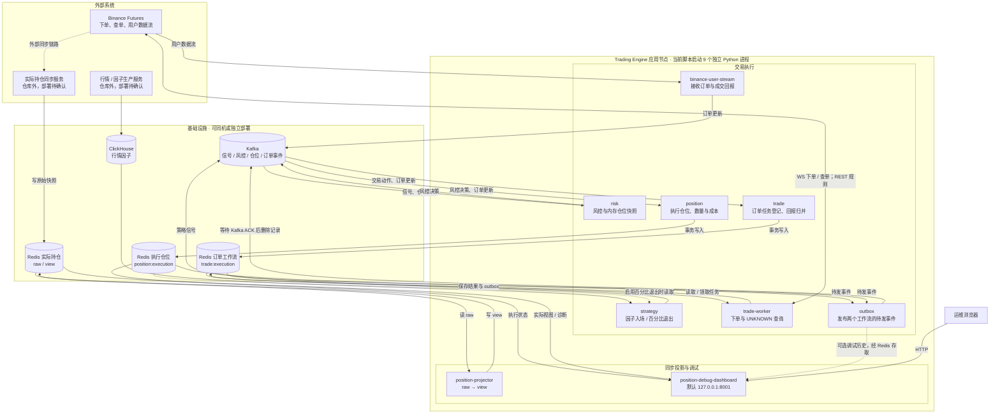

# 平台部署架构

依据当前启动脚本与生产入口绘制，表示代码支持的部署关系，不是对线上服务器的探测。当前脚本在一个应用节点启动 9 个独立 Python 进程；基础设施可同机或独立部署。三个 Redis 图块表示逻辑数据区，不要求三个实例。

实线表示仓库中明确的读写关系；虚线表示可选或仓库外路径。outbox → dashboard 表示调试历史的数据用途：实际由 observer 写 Redis、dashboard 读 Redis，没有直接 HTTP 调用。仓库外的行情/因子生产与持仓同步服务不由 start.sh all 启动，其具体部署未核查。

## Kafka 默认路由

| Topic | 生产者 | 本仓库消费者 |
|---|---|---|
| strategy.signal.generated.v1 | strategy | risk |
| risk.decision.made.v1 | risk | position |
| position.state.changed.v1 | outbox，内容来自 position | risk |
| trade.action.requested.v1 | outbox，内容来自 position | trade |
| trade.order.update.received.v1 | 用户流；outbox 发布 worker 结果 | position、trade |
| trade.action.failed.v1 | outbox，内容来自 position | 无内置业务消费者 |

trade 登记任务，trade-worker 从 Redis 领取任务执行，outbox 发布结果；这三个进程需同时运行。一个 outbox 进程处理仓位、订单两个待发事件流。

## 数据与部署边界

- 执行仓位：`position:execution:{account}:*`，保存数量、开仓均价、执行状态、inbox/outbox 和初始化标志。
- 订单工作流：`trade:execution:{account}:*`，保存订单、累计成交数量/金额、任务调度、租约及 inbox/outbox。
- 实际持仓：`binance:position:usdt_futures:raw:*` / `view:*`，由外部采集与本仓库投影器更新，不覆盖执行仓位。risk 不从该视图自动加载启动持仓，两条链路尚无全账户自动对账闭环。
- 旧订单库仍用于迁移，worker 启动时导入旧活动订单进入查询恢复；新结果不双写旧库。调试历史经 Redis 保存，属于 best-effort 观察记录。
- `position-state-migrate` 是一次性迁移/初始化命令，不是常驻进程。position 及启用价格退出的 strategy 启动前需要初始化标志。
- 当前 start.sh 使用 nohup，无自动拉起、容器编排或 readiness 屏障。all 发出启动命令不等于服务就绪。先准备基础设施和执行状态，确认恢复及消费者就绪后再启用策略。
- position/trade 在 Redis 事务成功后确认 Kafka 消息；outbox 收到 Kafka ACK 后删除待发记录。这是至少一次投递与去重，不是跨系统分布式事务。
- Redis 执行库是持久化业务存储；Kafka/Redis 集群副本与容灾配置未由仓库定义。
- dashboard 默认监听 127.0.0.1:8001，图中的浏览器表示本机访问，远程访问需另行配置。
- 百分比平仓读取执行仓位，以 ClickHouse 因子 close 轮询触发，需要 strategy 与整条执行链路运行，不是交易所托管止损。

依据：[启动脚本](../start.sh)、[进程注册表](../src/trading_engine/app/engine_registry.py)、[工作流服务](../src/trading_engine/app/run_workflow_services.py)。启动步骤见 [工作流操作说明](inbox-outbox-operations.md)，价格规则见 [成本与退出说明](execution-cost-and-price-exits.md)。

