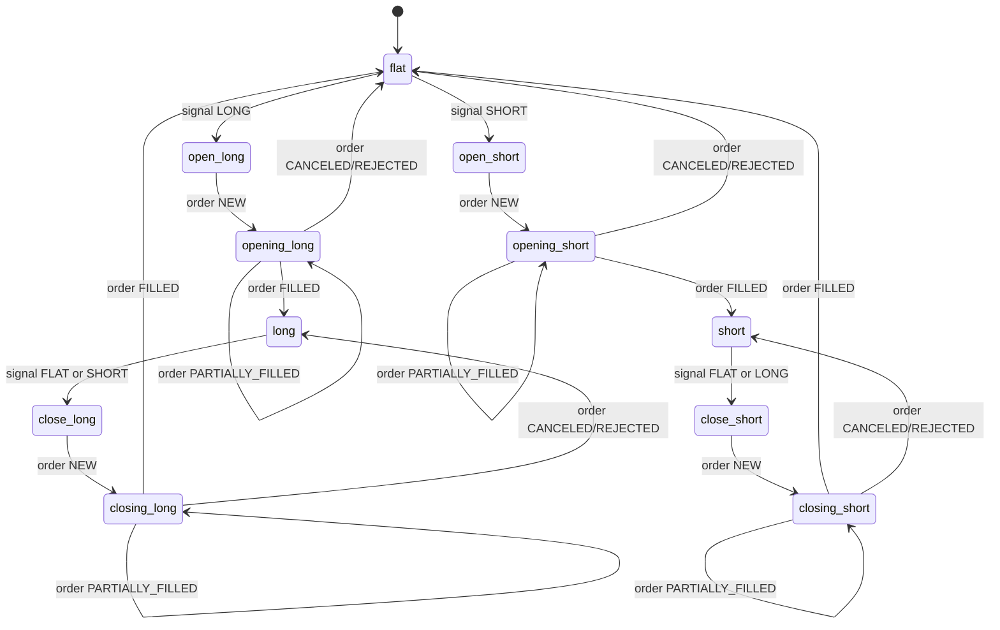

# Position 状态机一页纸速查表

## 1. 先记住这个主链路

Risk 决策事件 -> PositionManager -> Redis 保存最新 PositionState -> Kafka 发布状态变化/交易动作 -> TradeEngine 下单 -> Binance 回报订单更新 -> PositionManager 再次推进状态。

对应代码入口：
- app 层消息处理：[src/trading_engine/app/position_engine_kafka.py](../src/trading_engine/app/position_engine_kafka.py)
- 状态机主体：[src/trading_engine/position/manager.py](../src/trading_engine/position/manager.py)
- Redis 仓储：[src/trading_engine/infra/redis_position_repository.py](../src/trading_engine/infra/redis_position_repository.py)

## 2. Lifecycle 状态图

说明：
- open_xxx / close_xxx 是意图态（刚收到信号，准备下单）。
- opening_xxx / closing_xxx 是订单进行态（已收到 NEW，等待成交）。
- long / short / flat 是稳定态。

## 3. 事件 -> Redis 字段变化速查

Redis 主状态是每个 symbol 一条 JSON（默认键格式是 position:{symbol}）。

| 事件 | 前置 lifecycle | 新 lifecycle | direction | quantity 变化 | 关键字段变化 |
|---|---|---|---|---|---|
| signal LONG | flat | open_long | 保持 flat | 不变 | metadata 写入 signal_direction/signal_score |
| signal SHORT | flat | open_short | 保持 flat | 不变 | 同上 |
| signal FLAT | long/short | close_long/close_short | 保持 long/short | 不变 | 准备平仓 |
| order NEW | open/close_* | opening/closing_* | 通常不变 | 不变 | active_order_id, active_client_order_id 写入 |
| order PARTIALLY_FILLED (开仓) | opening_* | opening_* | long/short | 累加 delta | metadata.active_order_cumulative_filled 更新 |
| order PARTIALLY_FILLED (平仓) | closing_* | closing_* | long/short | 递减 delta | metadata.active_order_cumulative_filled 更新 |
| order FILLED (开仓) | opening_long/opening_short | long/short | long/short | 变为 filled_quantity | active_order_id 清空，last_order_id 落盘 |
| order FILLED (平仓) | closing_long/closing_short | flat | flat | 归零 | active_order_id 清空，last_order_id 落盘 |
| order CANCELED/REJECTED | opening/closing/open/close_* | 回滚到稳定态 | 按回滚结果 | 按回滚结果 | 写 TradeActionFailed 事件 |
| 超时恢复 | 任何过渡态 | 回滚到稳定态 | 按回滚结果 | 按回滚结果 | status=timed_out |

## 4. active_order_id 的作用

- 这是执行类更新的闸门字段。
- 对 PARTIALLY_FILLED / FILLED / CANCELED / REJECTED：
  - 没有 order_id，拒绝更新。
  - 当前状态没有 active_order_id，拒绝更新。
  - 两者不相等，拒绝更新。

这样可以避免别的订单回报误改当前状态。

对应校验逻辑位置：
- [src/trading_engine/position/manager.py](../src/trading_engine/position/manager.py)

## 5. 为什么部分成交不会重复累计

状态机会优先用 cumulative_filled_quantity 计算 delta：
- delta = max(current_cum - previous_cum, 0)
- 如果 delta <= 0，直接视为重放，状态保持不变。

previous_cum 存在 metadata.active_order_cumulative_filled。

## 6. 两套 Redis 视图不要混淆

1) PositionManager 仓储键
- 默认前缀来自 POSITION_REDIS_KEY_PREFIX（默认值 position）
- 键示例：position:BTCUSDT

2) Raw -> View Projector 键
- 默认前缀：binance:position:usdt_futures
- 键示例：binance:position:usdt_futures:view:state:BTCUSDT:v1

如果两边前缀配置不一致，你会看到“投影视图在更新，但状态机读到的是另一套键”。

相关实现：
- [src/trading_engine/infra/redis_position_view_projector.py](../src/trading_engine/infra/redis_position_view_projector.py)
- [docs/position-redis-view-spec-v1.md](position-redis-view-spec-v1.md)

## 7. 最快调试路径

1. 先观察当前 symbol 的 Redis JSON，确认 lifecycle、active_order_id、quantity。
2. 收到订单更新后，先对 order_id 是否匹配 active_order_id。
3. 如果 quantity 异常，检查 cumulative_filled_quantity 与 metadata.active_order_cumulative_filled。
4. 如果长期卡在 opening/closing，检查超时恢复是否触发。
5. 同时核对 PositionManager 使用的键前缀与 projector 前缀是否一致。

## 8. 推荐阅读顺序（15 分钟）

1. [src/trading_engine/app/position_engine_kafka.py](../src/trading_engine/app/position_engine_kafka.py)
2. [src/trading_engine/position/models.py](../src/trading_engine/position/models.py)
3. [src/trading_engine/position/manager.py](../src/trading_engine/position/manager.py)
4. [tests/unit/position/test_manager.py](../tests/unit/position/test_manager.py)
5. [src/trading_engine/infra/redis_position_repository.py](../src/trading_engine/infra/redis_position_repository.py)
6. [src/trading_engine/infra/redis_position_view_projector.py](../src/trading_engine/infra/redis_position_view_projector.py)
